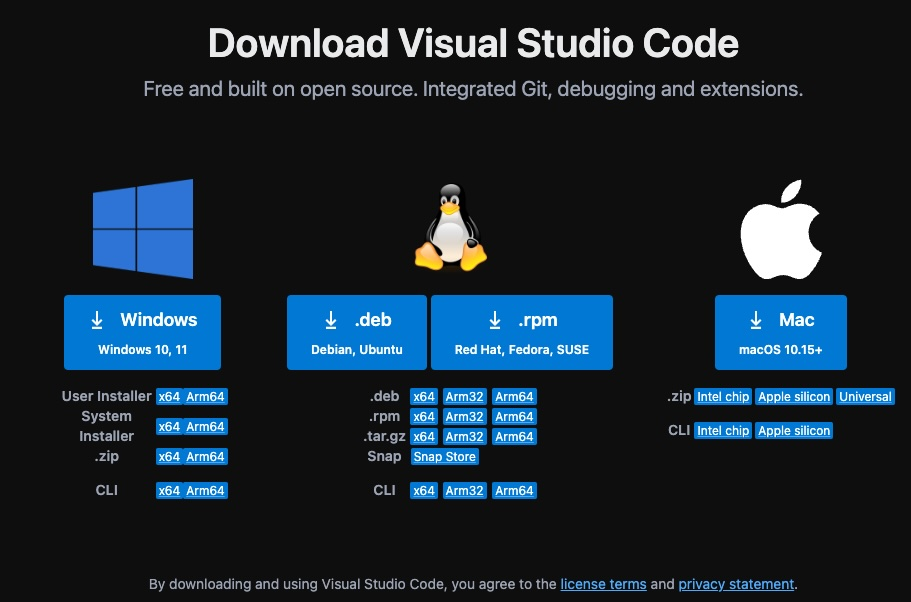
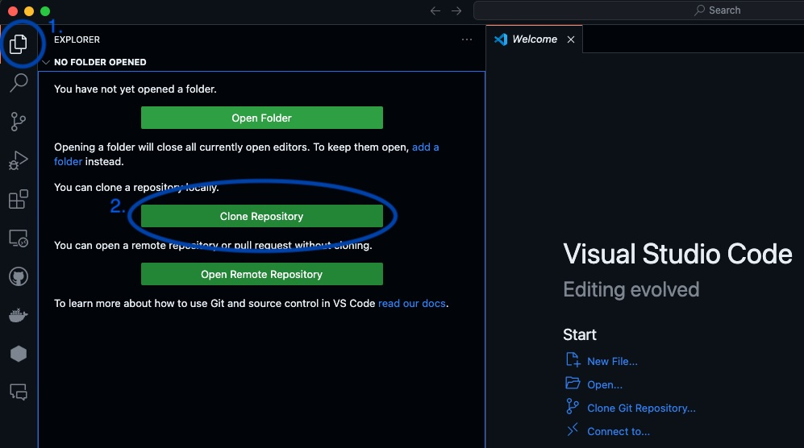
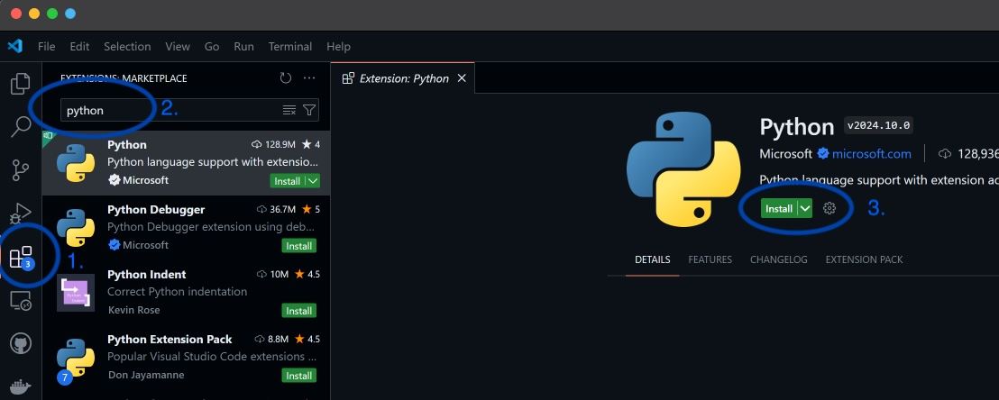
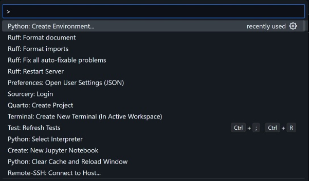
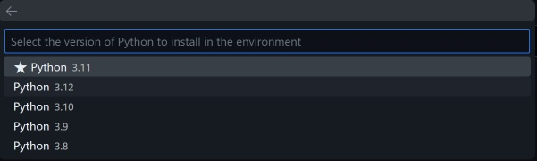

## Local Setup
1. Navigate to the [https://code.visualstudio.com/](https://code.visualstudio.com/) with your web browser.  

2. Download Visual Studio Code for your specific platform/Operating System.  

    

3. Run the Visual Studio Code Installer and follow all prompts.  

4. Open Visual Studio Code, navigate to the File Explorer (1.) and clone this repository (2.), entering the following repository name `https://github.com/CurtinIDS/CIDS_Carpentries_Python`, then selecting your preferred folder destination. 
    - If asked "`Would you like to open this repository?`", click "`Open`". 
    - If asked: "`Do you trust the authors of the files in this folder?`" click "`Trust Folder & Continue`", read the dialogue and then click "`Yes, I trust the authors`"

    
5. Navigate to the Extension sidebar (1.) then search (2.) for and install both the Python and Jupyter extensions.  

    
6. With the repository folder you downloaded earlier still open, enter the Visual Studio Code Command Pallette using `Ctrl + Shift + P` (Windows) or `Command + Shift + P` (MacOS) and locate `Python: Create Environment`.  If you cannot find it, you can partially type `Python` and the list should be filtered more

      
7. Select `Conda`.

    
8. Select `Python 3.11`.  

    
9. Open Command Prompt or Terminal within Visual Studio Code using `Ctrl + J` (Windows) or `Command + J` (MacOS).  

10. Run the following command to install dependencies.  

    `pip install -r requirements.txt`

### Google Colab
If you were unable to complete the above steps, you may alternatively access the workshop material using Google Colaboratory (colab) as an emergency measure. Please ensure that you have a Google Account.
1. [Episode 1 - Python Fundamentals](https://colab.research.google.com/github/CurtinIDS/CIDS_Carpentries_Python/blob/main/notebooks_colab/1_Python_Fundamentals_colab.ipynb)
2. [Episode 2 - Analysing Patient Data](https://colab.research.google.com/github/CurtinIDS/CIDS_Carpentries_Python/blob/main/notebooks_colab/2_Analysing_Patient_Data_colab.ipynb)
3. [Episode 3 - Visualising Tabular Data](https://colab.research.google.com/github/CurtinIDS/CIDS_Carpentries_Python/blob/main/notebooks_colab/3_Visualising_Tabular_Data_colab.ipynb)
4. [Episode 4 - Storing Multiple Values in Lists](https://colab.research.google.com/github/CurtinIDS/CIDS_Carpentries_Python/blob/main/notebooks_colab/4_Storing_Multiple_Values_in_Lists_colab.ipynb)
5. [Episode 5 - Repeating Actions with Loops](https://colab.research.google.com/github/CurtinIDS/CIDS_Carpentries_Python/blob/main/notebooks_colab/5_Repeating_Actions_with_Loops_colab.ipynb)
6. [Episode 6 - Analysing Data from Multiple Files](https://colab.research.google.com/github/CurtinIDS/CIDS_Carpentries_Python/blob/main/notebooks_colab/6_Analysing_Data_from_Multiple_Files_colab.ipynb)
7. [Episode 7 - Making Choices](https://colab.research.google.com/github/CurtinIDS/CIDS_Carpentries_Python/blob/main/notebooks_colab/7_Making_Choices_colab.ipynb)
8. [Epsiode 8 - Creating Functions](https://colab.research.google.com/github/CurtinIDS/CIDS_Carpentries_Python/blob/main/notebooks_colab/8_Creating_Functions_colab.ipynb)
9. [Episode 9 - Data Analysis with Pandas](https://colab.research.google.com/github/CurtinIDS/CIDS_Carpentries_Python/blob/main/notebooks_colab/9_Data_Analysis_with_Pandas_colab.ipynb)

[//]: # (Note for people editing this file. To create a colab link, combine the prefix:)

[//]: # (https://colab.research.google.com/github/)

[//]: # (With a link to the file in that repo including the blob/main, e.g.:)

[//]: # (CurtinIDS/CIDS_Carpentries_Python/blob/main/notebooks_colab/1_Python_Fundamentals_colab.ipynb)